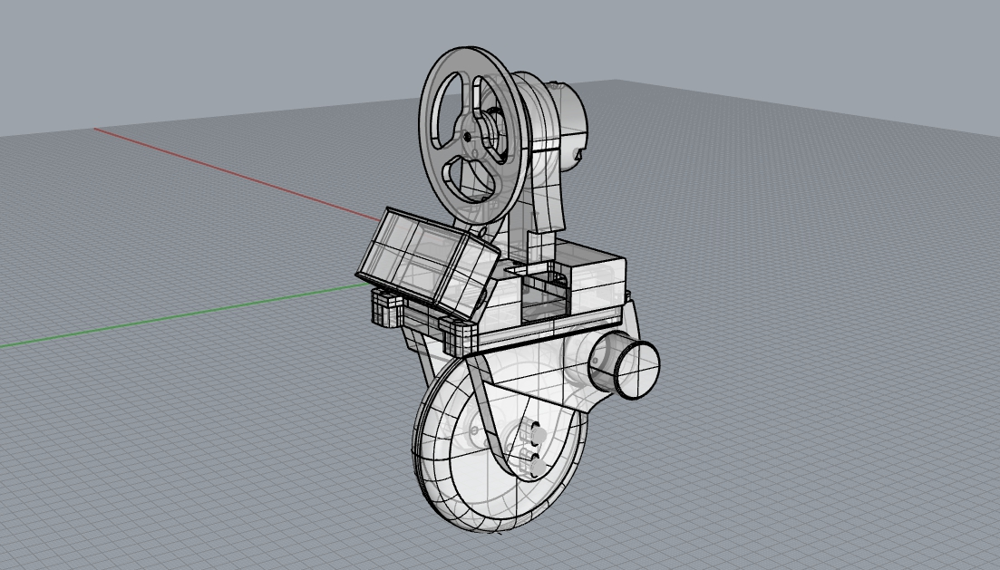

# ONE-Robot
> 2015年做的一个基于IMU和STM32的独轮自平衡机器人。

仓库包含STM32的固件源码以及机械结构的3D模型，控制板的电路由于年代久远以及不知去向。不过电路很简单，基本就是一个STM32F103的最小系统，引出了两路PWM控制两个电机；两路计时器用于读取编码器数据；以及几路用于读取模拟陀螺仪和加速度计的ADC。感兴趣有基础的同学可以自己研究一下~

演示视频看这个：

